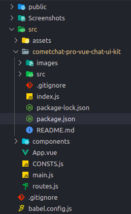
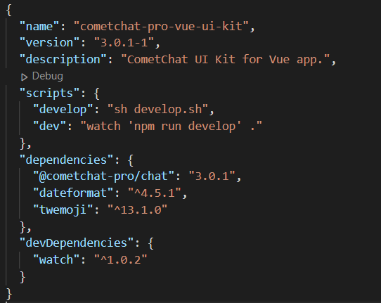

<div style="width:100%">
    <div style="width:50%;">
        <div align="center">
            
        </div>    
    </div>    
</div>

<br/><br/>

# CometChat Vue UI Kit

<p align="left">
  <a href="https://github.com/cometchat-pro/cometchat-pro-vue-ui-kit/releases/" alt="Releases">
    
  </a>
  <a href="https://img.shields.io/github/languages/top/cometchat-pro/cometchat-pro-vue-ui-kit">
    
  </a>
  <a href="https://github.com/cometchat-pro/cometchat-pro-vue-ui-kit/stargazers">
    
  </a>
  <a href="https://twitter.com/CometChat">
    
  </a>
</p>

</br></br>


CometChat Vue UI Kit is a collection of custom UI Components designed to build text chat and voice/video callings features in your application.

The UI Kit is developed to keep developers in mind and aims to reduce development efforts significantly.

---

## Prerequisites

Before you begin, ensure you have met the following requirements:

- A text editor. (e.g. [Visual Studio Code](https://code.visualstudio.com/), [Notepad++](https://notepad-plus-plus.org/), [Sublime Text](https://www.sublimetext.com/), [Atom](https://atom.io/), or [VIM](https://www.vim.org/))

- [Node](https://nodejs.org/)

- [npm](https://www.npmjs.com/get-npm)

- [Vue](https://vuejs.org/)

## Installing Vue UI Kit

## 1. Setup

### i. Register on CometChat 🔧

- To install Vue UI Kit, you need to first register on CometChat Dashboard. <a href="https://app.cometchat.com/signup" target="_blank">Click here to Sign Up.</a>

### ii. Get your application keys 🔑

- Create a new app.
- Head over to the Quick Start or API & Auth Keys section and note the `App ID`, `Auth Key`, and `Region`.

### iii. Add the CometChat dependency 📦

```javascript
  npm install @cometchat-pro/chat@3.0.2-beta1 --save
```

<br/>

## 2. Configure CometChat inside your app

### i. Import CometChat SDK

```
import { CometChat } from "@cometchat-pro/chat";
```

### ii. Initialize CometChat 🌟

The `init()` method initializes the settings required for CometChat.  
We suggest calling the `init()` method on app startup, preferably in the `created()` method of the Application class.

```javascript
const appID = 'APP_ID';
const region = 'REGION';
const appSetting = new CometChat.AppSettingsBuilder()
  .subscribePresenceForAllUsers()
  .setRegion(region)
  .build();

CometChat.init(appID, appSetting).then(
  () => {
    console.log('Initialization completed successfully');
    // You can now call login function.
  },
  (error) => {
    console.log('Initialization failed with error:', error);
    // Check the reason for error and take appropriate action.
  }
);
```

**Note:**</br>

- Replace `APP_ID` and `REGION` with your CometChat `App ID` and `Region` in the above code.

### iii. Login your user 👤

This method takes `UID` and `Auth Key` as input parameters and returns the User object containing all the information of the logged-in user.

```javascript
const authKey = 'AUTH_KEY';
const uid = 'SUPERHERO1';

CometChat.login(uid, authKey).then(
  (user) => {
    console.log('Login Successful:', { user });
  },
  (error) => {
    console.log('Login failed with exception:', { error });
  }
);
```

**Note:** </br>

- Replace `AUTH_KEY` with your CometChat `Auth Key` in the above code.

- We have setup 5 users for testing having UIDs: `SUPERHERO1`, `SUPERHERO2`, `SUPERHERO3`,`SUPERHERO4` and `SUPERHERO5`.

- We have used uid `SUPERHERO1` as an example here. You can create User from CometChat Dashboard as well.

<br/>

## 3. Add UI Kit to your project

- Clone this repository

```
git clone https://github.com/cometchat-pro/cometchat-pro-vue-ui-kit.git
```

- Copy the folder to your source folder.



- Copy all the dependencies from package.json of `cometchat-pro-vue-ui-kit` into your project's package.json and install them.

- We are using [emoji-mart-vue-fast](https://www.npmjs.com/package/emoji-mart-vue-fast)
Please install respective library depending on your Vue version
    - For Vue2 : `npm install emoji-mart-vue-fast@7.0.7`
    - For Vue3 : `npm install emoji-mart-vue-fast@8.0.3`
    - For Vite users:`npm install emoji-mart-fast-vue@9.1.2`


<br/>

**Support for Vite**

If you are using Vite, update your vite.config.js

    
```
import { defineConfig } from 'vite'
import vue from '@vitejs/plugin-vue'

// https://vitejs.dev/config/
export default defineConfig({
  plugins: [vue()],
  resolve: {
    extensions: ['.mjs', '.js', '.ts', '.jsx', '.tsx', '.json', '.vue'],
  },
})
```

## 4. Launch CometChat

Using the `CometChatUI` component from the UI Kit, you can launch a fully functional chat application.  
In this component all the UI Screens and UI Components are interlinked and work together to launch a fully functional chat on your website/application.

Usage of application in project:

```html
<template>
  <div id="app">
    <CometChatUI />
  </div>
</template>

<script>
  import { CometChatUI } from './cometchat-pro-vue-ui-kit/CometChatWorkspace/src';
  export default {
    name: 'App',
    components: {
      CometChatUI,
    },
  };
</script>
```

---

# Checkout our sample app

Visit our [Vue sample app](https://github.com/cometchat-pro/javascript-vue-chat-app/) repo to run the Vue sample app.

- For Vue2 sample app, navigate to vue2 folder
- For Vue3 sample app, navigate to vue3 folder

---

# Troubleshooting

- To read the full documentation on UI Kit integration visit our [Documentation](https://www.cometchat.com/docs/vue-chat-ui-kit/overview).

- Facing any issues while integrating or installing the UI Kit please connect with us via real time support present in <a href="https://app.cometchat.com/" target="_blank">CometChat Dashboard.</a>

---

# Contact 📪

Contact us via real time support present in [CometChat Dashboard](https://app.cometchat.com/).

---

# License

---

This project uses the following [license](https://github.com/cometchat-pro/cometchat-pro-vue-ui-kit/blob/master/LICENSE).
